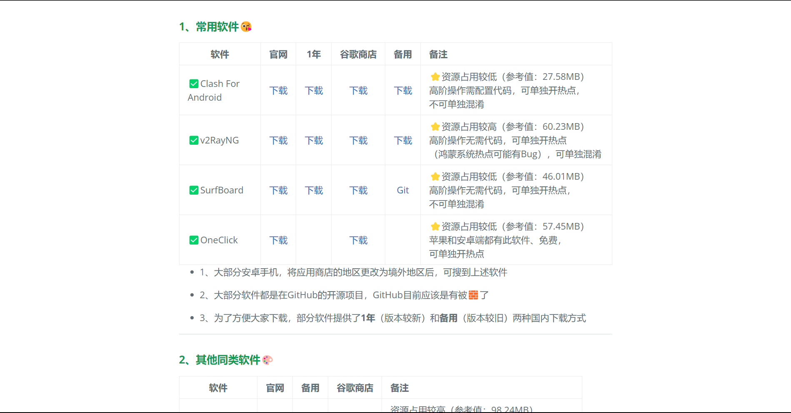
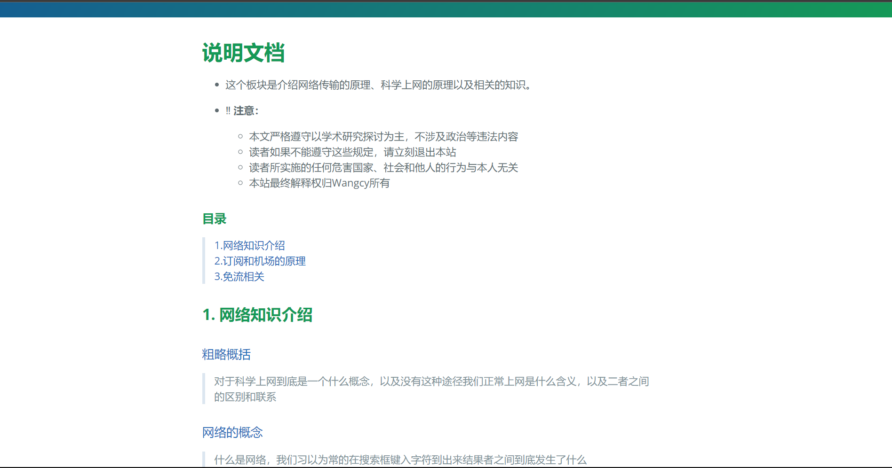
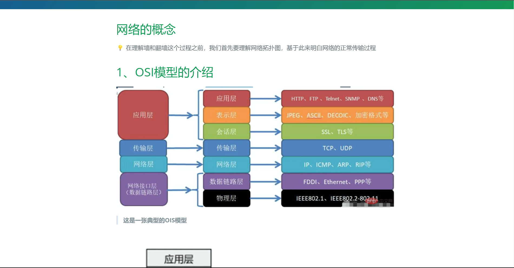

# 翻墙小道

<!-- logo -->
<p align="center">
    <a href="https://wangcy.tk" alt="Wangcy Logo">
    </a>
</p>

<!--个人项目跳转页-->
<div align="center">
    <a href="https://ycu.wangcy.cf">YCU起始页</a> |
    <a href="https://sou.wangcy.tk">简约起始页</a> |
    <a href="https://wangcy.tk/Wallpaper">壁纸</a> |
    <a href="https://donate.wangcy.tk">投喂</a> 
</div>

<!--语言标识-->
<br>
<p align="center">
    
    
    <a href="https://github.com/pages-themes/cayman" ></a>
</p>

<!--语言切换-->
<p align="center">
    <a href="./CHN.md"></a>
    <a href="./Eng.md"></a>
</p>    
    
本站旨在尽可能全面的搜集科学上网的信息，并进行整理，以供交流。在使用本站之前确保您已经熟悉所在国相关法律，并且能够认识自己行为的法律属性，以及对自己的行为负责。严禁使用本站提供的信息从事非法活动或者获取其他不正当利益。如果不能遵守这些规定，请不要使用本站提供的服务。违反相关规定使用本站信息服务给国家、社会以及他人造成损害与本站及本站制作人无关。请使用者和浏览者认真学习有关法律法规，做遵纪守法好公民！严禁在国内传播并用于非法活动！！！

# 目录
> [1.建站声明](#1%E5%BB%BA%E7%AB%99%E5%A3%B0%E6%98%8E)<br>
> [2.建站过程](#2%E5%BB%BA%E7%AB%99%E8%BF%87%E7%A8%8B)<br>
> [3.站点内容](#3%E7%AB%99%E7%82%B9%E5%86%85%E5%AE%B9)<br>
> [4.预览效果](#4%E9%A2%84%E8%A7%88%E6%95%88%E6%9E%9C)

# 1.建站声明

> 出于学习交流目的建立此站，与此无关的盈利行为和非法行为与作者无关。
> 本站作者既不希望也不提倡在未经相关组织许可或者为传播不当信息为目的使用本站所提供的工具和信息<br>

使用者请确保已经已经学习了有关于长城防火墙的产生原因和工作原理等网络安全知识和刑法网络安全罪名、行政法规对访问国外网站和自建国际互联网信道的有关知识。
如果对以上概念不熟悉或对自己的使用性质不能明确的禁止使用本站点提供的内容，如果从其他途径获得了与本站提供的服务相似或者能够达到相同目的的与本站无关。<br>

🤣这个项目就是我做着玩玩的，如果大佬看到了请高抬贵手，对我的不当行为做出指正。同好们看到了觉得有用、好玩的话就私下玩玩，不要当真，不要传播。

# 2.建站过程

1⃣️这个项目是我本人除了使用的Jekyll模板等内容外自主编写的，虽然实现原理很简单，但还是很有成就感的。本片说明也是我第一次写README<br>
2⃣️本站以Jekyll的[Cayman](https://github.com/pages-themes/cayman)主题为基础，变更相对链接为绝对链接；本站点所引用的主题转为本站点的内容深度定制，并不适合其他人用作自己的```jekyll主题```，如需使用还请使用原版。<br>

> 具体修改内容和修改方法：[详见此处](https://github.com/wchenyi/cayman#readme)

在这里对原作者表示衷心的敬佩和感谢，如果本文内容有侵权或者其他违规内容，请联系本人，本人会在第一时间进行删除，并作出道歉。
    

# 3.站点内容

1⃣️本站并不只是一个单纯的下载网站，内部还有很多的说明文档和相关信息推荐。内容会不定时更新，但不能保证最新，也不能保证一定准确和有效；如果对此介意，请慎用。<br>
2⃣️本站说明文档的内容来源于自己的一些思考和油管博主**电丸科技AK**、**不良林**的视频内容，自行进行了整理。如有侵权请联系我进行删除，本人对此给各位大佬造成的不便衷心的感到抱歉！<br>
3⃣️本站最初只是为了自己需要，在网上搜集各种工具的官网地址后以较为舒适的表现形式进行整理。后面内容多了之后整理成一个专门的站点，并为了更好的观感而不断优化界面和内容布局。站点提供包括但不限于以下服务：<br>
- *安卓｜鸿蒙、Windows、Mac、IOS、iPad OS、LInux*等平台的工具下载渠道。
- 对部分软件来源的说明（不含具体使用方法）
- 对科学上网的概念、原理说明
- 转换工具、流媒体拼车平台、谷歌工具
- 个人心得、测评等

# 4.预览效果
在线演示：[点击跳转](https://wangcy.tk/wall) ，如果感兴趣可以Star，想要以此为基础自建的话可以[Fork](https://github.com/login?return_to=%2Fwchenyi%2Fwall)，或者点个[Star](https://github.com/login?return_to=%2Fwchenyi%2Fwall)

| 主页 | 下载页面 | 说明文档 | 原理 |
|--|--|--|--|
|  [跳转](http://wangcy.tk/wall/)  |  [跳转](http://wangcy.tk/wall/assets/Android) |  [跳转](http://wangcy.tk/wall/assets/doc) |  [跳转](http://wangcy.tk/wall/Awall/%E7%BD%91%E7%BB%9C%E7%9A%84%E6%A6%82%E5%BF%B5) |
